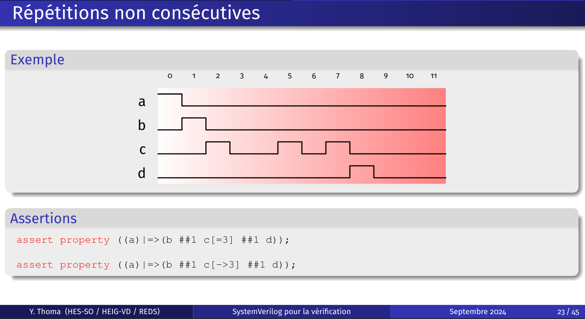
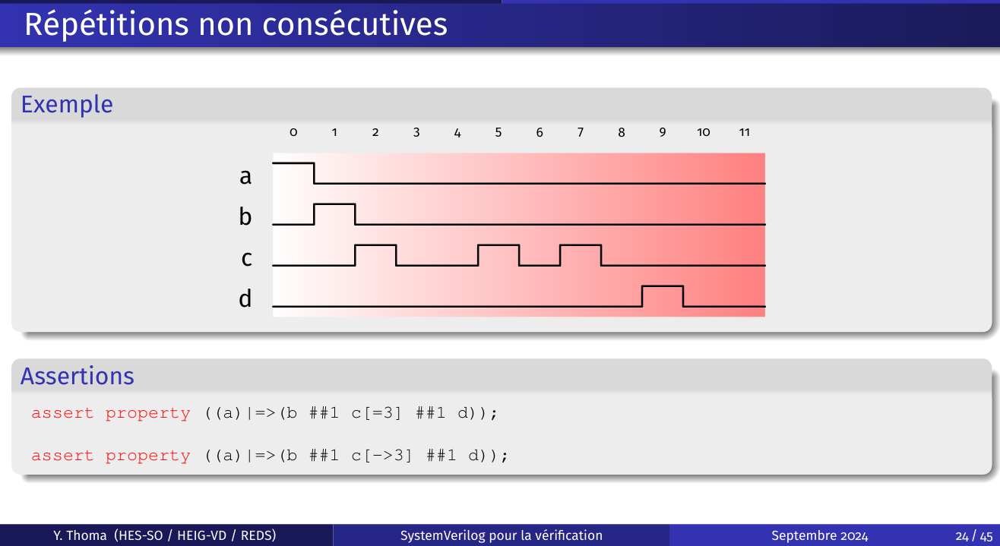
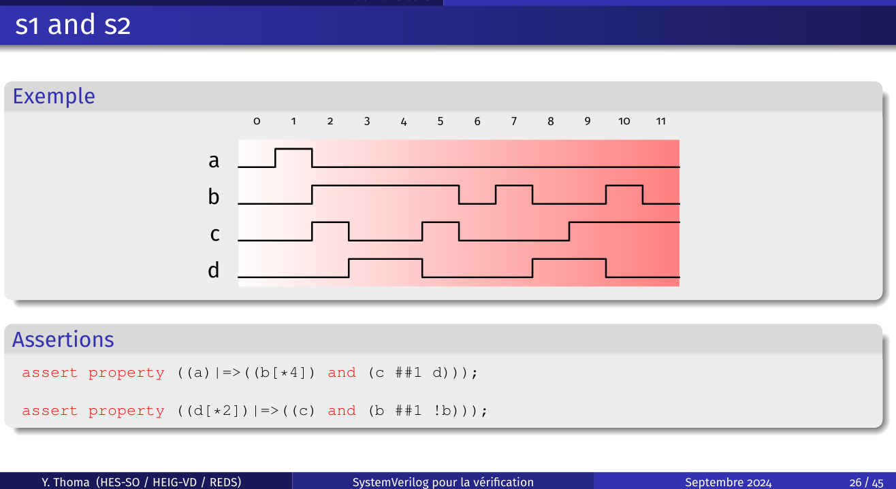
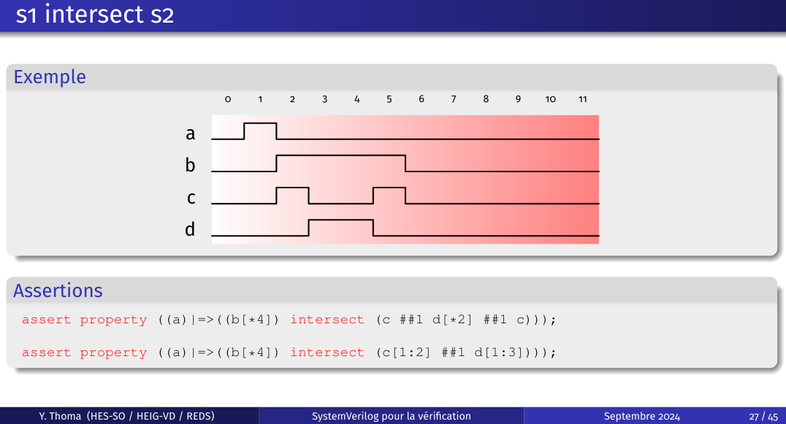
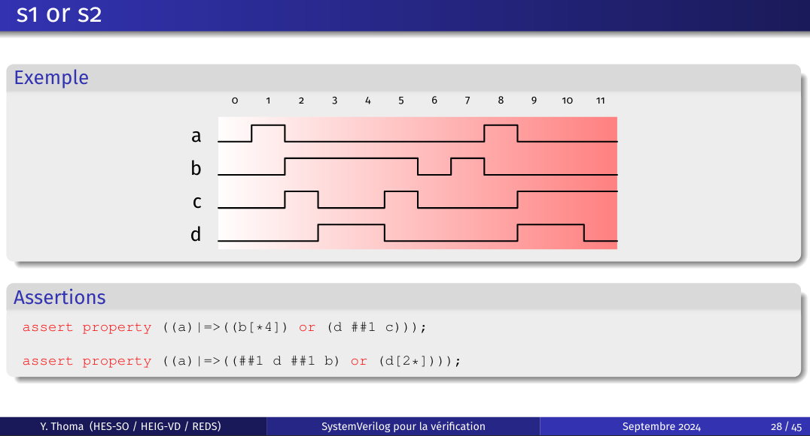
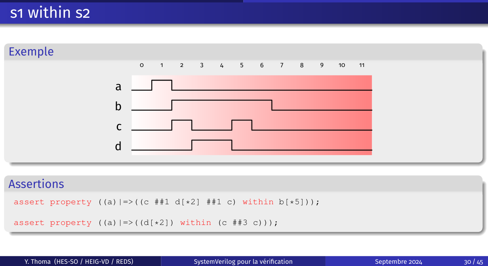

# 23


OK OK

# 24


OK NOK

# 26


OK OK

## 27



OK NOK

## 28



OK OK

## 29


OK OK

## 30



OK OK

## Exemple 1

- Lorsqu’une requête (activation de req) est émise, alors un acknowledge (activation de ack) doit arriver au plus tard 5 cycles d’horloge après

```systemverilog
req |-> ##[0:5] ack;
```

## Exemple 2

- Les entrées a et b doivent rester stables tant que valid est actif

```systemverilog
valid |-> $stable(a) && $stable(b); // Pas bon, car si a suit valid, a sera rising et pas stable 

valid && $stable(valid) |-> $stable(a) && $stable(b); // Ok pour des pulses plus grandes que 1 cycle

valid[*2] |-> $stable(a) && $stable(b); // Ok, on attend qu'il soit stable (2 cycles)
```
