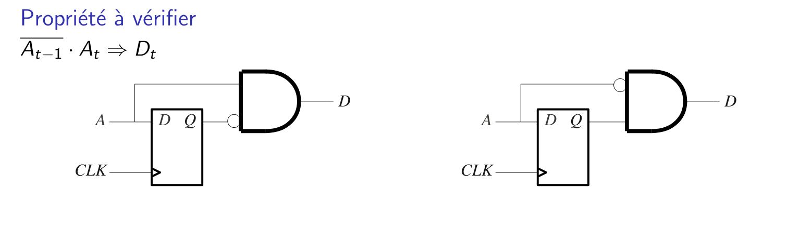

!At-1 . At => Dt

!(!At-1 . At) + Dt = 1

At-1 + !At + Dt = 1

1)

Dt = At . !At-1

At-1 + !At + At . !At-1 = 1 

Et donc

|At-1|At|Res|
|-|-|-|
|0|0|1|
|0|1|1|
|1|0|1|
|1|1|1|

2) 

Dt =  !At . At-1

At-1 + !At + !At . At-1 = 1
