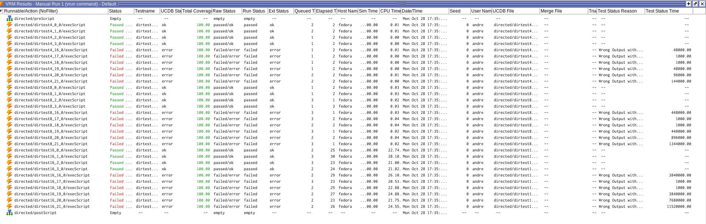

# VSE Labo 1 - Affichage linéaire d’une valeur entre deux bornes

#### André Costa

## Introduction

Ce labo consiste à développer un banc de test pour un système permettant l'affichage linéaire d'une valeur.
L'affichage est commandée de façon à indiquer où se situe cette valeur par rapport à deux bornes Min et Max.

## Paramètres Génériques

Les paramètres génériques sont les suivants:

- `VALSIZE` : Taille des valeurs d'entrée (Min, Max et Value)
- `ERRNO` : Utilisé pour générer des erreurs dans le code `vhdl`
- `TESTCASE` : Indique le numéro du test à effectuer. 0 devra indiquer que tous les tests doivent être effectués.

## Entrées et Sorties

- `Com_i` : Signal de commande
- `Val_i` : Valeur à afficher
- `Min_i` : Borne inférieur de la plage
- `Max_i` : Borne supérieur de la plage
- `Osc_i` : Signal d'oscillation
- `Leds_o` : Afficheur linéaire composé de leds.

## Procédure

Pour développer un système de test, j'ai commencé par le calcul de la valeur de référence.

5 cas de figure sont possibles:

1. `Com_i` = 1 : Mode linéaire, toutes les leds de 0 à `Val_i` doivent être allumées.

```verilog
for (int i = 0; i <= value; ++i) begin
          leds[i] = 1'b1;
end
```

2. `Com_i` = 2 : Test éteint, toutes les leds doivent être éteintes.

```verilog
leds = 0;
```

3. `Com_i` = 3 : Test allumé fort, toutes les leds doivent être allumées.

```verilog
leds = 2 ** (2 ** VALSIZE) - 1;
```

4. `Com_i` = 0 et `Val_i` < `Min_i` ou `Val_i` > `Max_i` : Toutes les leds doivent être éteintes.

```verilog
if (value < min || value > max) begin
          leds = 0;
end
```

5. `Com_i` = 0 et `Min_i` <= `Val_i` <= `Max_i`.
   Entre `Min_i` et `Val_i`, les leds doivent être allumées avec intensité forte.
   Entre `Val_i +1` et `Max_i`, les leds doivent être allumées avec intensité faible.
   Les autres leds doivent être éteintes.

Pour gérér une intensité faible, il suffit d'utiliser l'entrée oscilateur `Osc_i`.
Quand ce signal est à '1', les leds sont allumées, quand le signal est à '0', les leds sont éteintes.

```verilog
leds = 0; //Par défaut, toutes les leds sont éteintes

// Les leds entre min et value sont allumées avec intensité forte
for (int i = 0; i <= value; ++i) begin
          leds[i] = 1'b1;
end
//Les leds entre value + 1 et max sont allumées avec intensité faible
for(int i= value + 1; i <= max; ++i) begin
          leds[i] = osc;
end
```

Bien évidemment, que nous pouvons éviter de parcourir les leds de value + 1 à max si osc_i est à '0'. Gagnant ainsi en performance.

```verilog
int borne_fin = osc_i == 1'b1 ? max : value; // Calcul de la borne finale
leds = 0; //Par défaut, toutes les leds sont éteintes

// Les leds entre min et value sont allumées avec intensité forte
for (int i = 0; i <= borne_fin; ++i) begin
          leds[i] = 1'b1;
end
```

Une fois que nous arrivons à calculer correctement quel devrait être la sortie du système selon les différentes entrées possibles, nous pouvons décider quelles tests effectuer.

## Tests

Pour tester le système, idéalement, nous devrions tester toutes les combinaisons possibles des entrées. Cependant, cela est impossible en pratique car le nombre de combinaisons possibles selon `VALSIZE` peut être gigantesque.

Alors, divisons des tests selon les différents modes de fonctionnement du système.

### Test puissance de deux

Pour garder une bonne robustesse des tests, nous pouvons tester les puissances de 2 pour `Min_i`, `Max_i` et `Val_i`. Cela nous permet de tester des valeurs petites, moyennes et grandes sans sacrifier la performance. Vu qu'il s'avére intéressant de le faire avec plusieurs modes différentes, la tâche a été refactorisée en une fonction.

Ainsi, cette idée est utilisé pour tester les 4 modes de fonctionnement du système.

### Tests Allumé, Éteint et Linéaire

Vu la simplicité de ces trois modes, ces modes sont seulement testés avec toutes les valeurs de puissance de deux.

### Tests marche normale

En plus du test des puissances de deux, j'ai encore ajouté des autres tests pour ce mode de fonctionnement.
Pour le test marche normale, il faut tester 3 cas:

1. `Val_i` < `Min_i`
2. `Val_i` > `Max_i`
3. `Min_i` <= `Val_i` <= `Max_i`.

Pour les cas 1. et 2., j'utilise la randomisation avec contrainte.
Je fais quelques intérations avec des valeurs aléatoires pour `Val_i`, `Min_i` et `Max_i` pour être sûr que le système est robuste.

Bien évidemment que pour que cela marche, j'ai ajouté une contrainte pour que `Val_i` soit inférieur à `Min_i` ou `Val_i` soit supérieur à `Max_i` que je active seulement pour ces tests.

```verilog
    constraint value_bigger_than_max_c {value > max;}
    constraint value_smaller_than_min_c {value < min;}
```

Exemple avec le test `Val_i` > `Max_i`:

```verilog
task automatic test_marche_normale_values_bigger_than_max;
    Input obj;
    obj = new;
    obj.value_bigger_than_max_c.constraint_mode(1);
    obj.value_smaller_than_min_c.constraint_mode(0);
    obj.value_between_max_and_min_c.constraint_mode(0);

    $display("Running Test Marche Normale val > max");
    for (int i = 0; i < 10; ++i) begin
      random_or_fatal(obj);
      obj.com = 0;
      map_obj_to_input_itf(obj);
      test_both_osci_state();
    end
  endtask
```

Pour le cas où `Min_i` <= `Val_i` <= `Max_i`, j'ai décidé de tester des valeurs vers la plage inférieur de valeurs, vers la plage supérieur de valeurs et des valeurs au milieu de la plage.

Ceci avec le test des puissances de deux, me permet déjà de garantir une bonne couverture des valeurs possibles.

### Tests aléatoires

Pour complémenter ces tests, un test qui teste des valeurs aléatoires a été ajouté.
Ceci me permet de tester des valeurs autres que la puissance de deux par exemple.

Pour garantir que je couvre bien toutes les plages de valeurs possibles, voici comment j'ai procédé:

1. Tout d'abord, toutes les valeurs seront générées aléatoirement, sauf pour osci_i. Pour cette dernière, pour chaque entrée, je la teste sur les deux possibilités d'osci_i

```verilog
class Input;
    rand logic [1:0] com;

    rand logic [VALSIZE-1:0] max;
    rand logic [VALSIZE-1:0] min;
    rand logic [VALSIZE-1:0] value;
    logic osci;
```

2. Ensuite, j'ai ajouté une distribution sur `com_i` pour que le mode normale soit plus probable que les autres:

```verilog
    constraint com_distribution_c {
      com dist {
        0 := 7,
        1 := 1,
        2 := 1,
        3 := 1
      };
    }
```

3. Niveau contraintes, j'ai ajouté la contrainte que `Max` doit être plus grand que `Min` car sinon le résultat est indéfini, ainsi que des contraintes sur l'ordre de randomisation des valeurs.

```verilog
    constraint max_bigger_than_min_c {max > min;}
    constraint order_max_c {solve max before min;}
    constraint order_value_c {solve max, min before value;}
```

4. J'ai aussi ajouté une contrainte pour être sûr que `Val_i`, `Max_i` et `Min_i` ne soient pas des puissances de deux, vu que ces tests ont déjà été effectués.

```verilog
    constraint not_power_of_two_c {!(value & (value - 1) == 0);}
    constraint not_power_of_two_max_c {!(max & (max - 1) == 0);}
    constraint not_power_of_two_min_c {!(min & (min - 1) == 0);}
```

5. Enfin, j'ai ajouté le `covergroup` qui me permettra de garantir qu'on teste bien toutes les plages de valeurs:

```verilog
    covergroup cov_group;
      option.auto_bin_max = 1000;
      cov_com: coverpoint com;
      cov_max: coverpoint max {
        option.auto_bin_max = 1000;
        bins petit = {[0 : max_value() / 4]};
        bins grand = {[max_value() - (max_value() / 4) : max_value()]};
        bins all_values[VALSIZE] = {[max_value() / 4 + 1 : max_value() - (max_value() / 4) - 1]};
      }
      cov_min: coverpoint min {
        option.auto_bin_max = 1000;
        bins petit = {[0 : max_value() / 4]};
        bins grand = {[max_value() - (max_value() / 4) : max_value()]};
        bins all_values[VALSIZE] = {[max_value() / 4 + 1 : max_value() - (max_value() / 4) - 1]};
      }
      cov_val: coverpoint value {
        option.auto_bin_max = 1000;
        bins petit = {[0 : max_value() / 4]};
        bins grand = {[max_value() - (max_value() / 4) : max_value()]};
        bins all_values[VALSIZE] = {[max_value() / 4 + 1 : max_value() - (max_value() / 4) - 1]};
      }
    endgroup
```

Une fois tout ça mis en place, le test avec les valeurs aléatoires est tout simplement:

```verilog
  task automatic test_random_values;
    Input obj;
    obj = new;
    obj.value_bigger_than_max_c.constraint_mode(0);
    obj.value_smaller_than_min_c.constraint_mode(0);
    obj.value_between_max_and_min_c.constraint_mode(0);

    $display("Running Test With Random Values");
    while (obj.cov_group.get_inst_coverage() < 100) begin
      random_or_fatal(obj);
      obj.cov_group.sample();
      map_obj_to_input_itf(obj);
      test_both_osci_state();
    end
  endtask
```

## Verification Run Manager

Une fois mes test écrits, j'ai complété le fichier `default.rmdb` pour y ajouter des tests.

J'ai ajouté des tests avec `VALSIZE` à 4, 8 et 16.
Et avec `ERRNO` dans les intervalles [0,3] et [16, 21].



Comme attendu, les tests avec `ERRNO` dans l'intervalle [0,3] passent, tandis que les tests avec `ERRNO` dans l'intervalle [16, 21] échouent.

Le temps de simulation est très court même pour `VALSIZE` à 16, ce qui est très bien pour itérer rapidement sur les tests.

## Lancement de tests spécifiques

Comme demandé sur la donnée, le TESTCASE=0 lance tous les tests.

Chaque test peut être lancé individuellement en spécifiant un autre numéro de test. La liste des tests est la suivante:

```verilog
case (TESTCASE)
      0: run_all_scenarios;
      1: test_eteint;
      2: test_allume_fort;
      3: test_val_lineaire;
      4: test_marche_normale_powers_of_2;
      5: test_marche_normale_values_between_min_and_max;
      6: test_marche_normale_values_less_than_min;
      7: test_marche_normale_values_bigger_than_max;
      8: test_random_values;
      9: test_every_combination;
      default: $diplay("Invalid test case %d", TESTCASE);
    endcase
```

Notons le cas 9 qui teste toutes les combinaisons possibles des valeurs mais seulement si `VALSIZE` est inférieur à 10. Ceci est le seul test qui n'est pas lancé automatiquement avec TESTCASE=0.

## Conclusion

Ce labo m'a permis de comprendre comment développer un banc de test pour un système en `vhdl`. J'ai appris à utiliser les `covergroup` pour garantir que je teste bien toutes les plages de valeurs possibles. J'ai aussi appris à utiliser les `constraint` pour garantir que les valeurs générées aléatoirement respectent les contraintes du système.

J'ai aussi appris à gérer le fait qu'il n'est pas toujours possible de tester toutes les combinaisons possibles des valeurs d'entrée. Pour résoudre cela, j'ai testé quelques cas limites et j'ai ajouté un peu de randomisation sous contraintes pour garantir que mon test couvre bien assez de possibilités pour que nous puissions être sûr que le système marche correctement. L'idée de tester les puissances de deux est aussi très intéressant et je remercie le prof pour l'idée.
