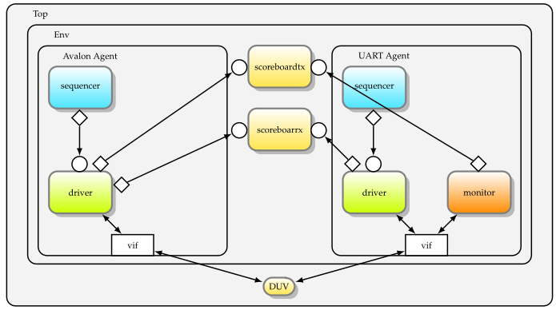
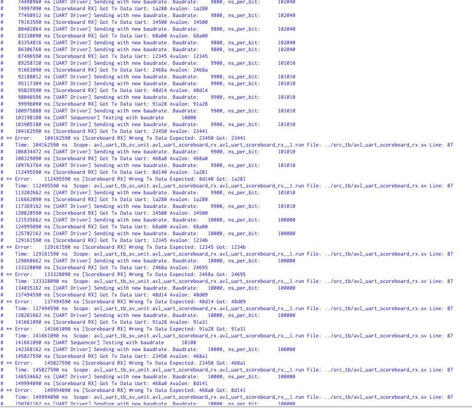
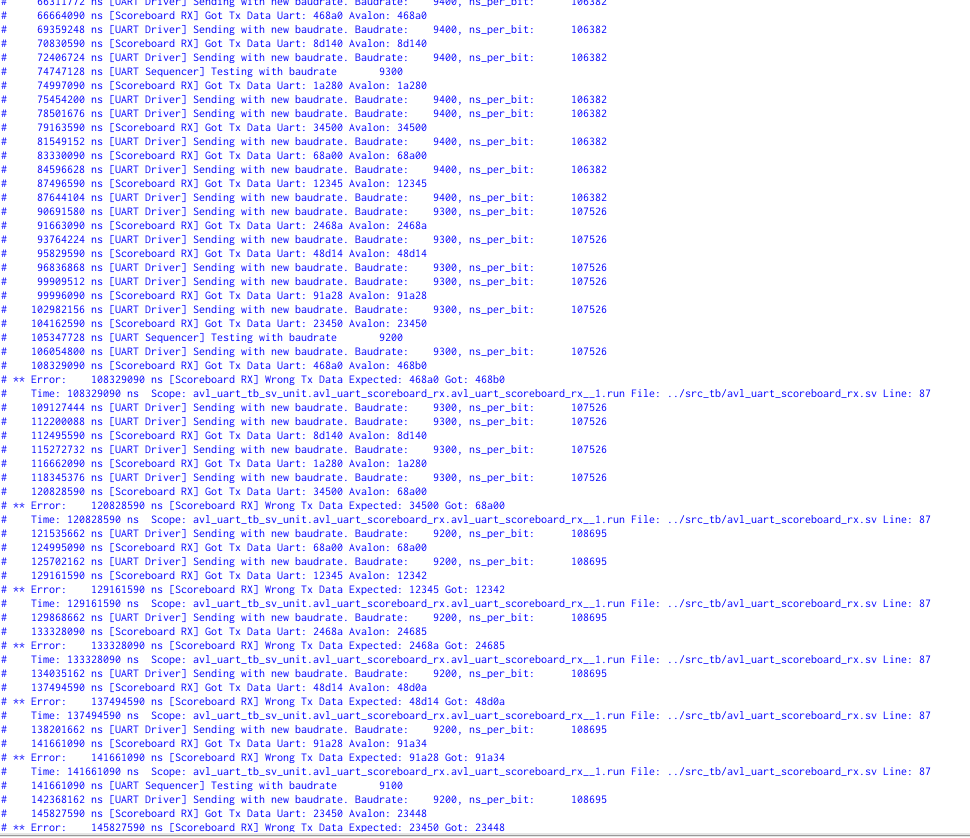
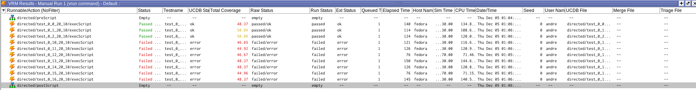

# VSE - Labo2

# Laboratoire de vérification SystemVerilog - UART

**André Costa**
**Alexandre Iorio**

# Introduction

Ce labo consiste à mettre un place un banc de test en SystemVerilog pour un périphérique UART.

# Architecture du banc de test



# Implémentation Driver UART

Nous avons commencé par implémenter les différents drivers.

Pour le driver UART, il doit être capable d'envoyer des données sur la ligne RX.
Le baudrate est fixé à 9600.

D'autre, pour des fonctionnalités plus avancées que nous expliquerons plus tard, nous avons aussi ajouté la possibilité d'indiquer au driver quel baudrate utiliser.

Une fois les données à envoyer, l'algorithme d'envoie est assez simple:

```verilog
 // Start Bit
vif.rx_i = 0;
#test_ns_per_bit;
for (int i = DATASIZE; i > 0; i--) begin
    vif.rx_i = transaction.data[i-1];
    #test_ns_per_bit;
end
// Stop Bit
vif.rx_i = 1;
#test_ns_per_bit;
```

En plus de cet algorithme, il doit aussi envoyer le transaction qu'il vient de jouer au scoreboard.

```verilog
uart_to_scoreboard_rx_fifo.put(transaction);
```

# Implémentation moniteur UART

Le moniteur UART est responsable de lire ce qu'il sort du DUV (ligne TX) et de l'envoyer ensuite au scoreboard.

Pour cela, il faut détecter le bit de start, le flanc descendant de la ligne TX, et ensuite lire les bits de données.

```verilog
uart_transaction #(DATASIZE, FIFOSIZE) transaction;
@(negedge vif.tx_o);

transaction = new;
transaction.transaction_type = UART_RX_DUV_TX;
// Attente du premier bit de données,
// on se place au milieu pour éviter de lire au moment du changement de bit
#(ns_per_bit + (ns_per_bit / 2));

for (int i = DATASIZE; i > 0; i--) begin
    transaction.data[i-1] = vif.tx_o;
    #ns_per_bit;
end
uart_to_scoreboard_tx_fifo.put(transaction);
```

# Implémentation driver Avalon

Le driver Avalon est plus complexe. En effet, il doit être capable d'intéragir avec les différents registres du périphérique.

Nous avons donc défini différentes commandes pour le driver Avalon:

```verilog
typedef enum {
  UART_SEND,
  UART_READ,
  SET_CLK_PER_BIT,
  ASSERT_TX_FIFO_EMPTY,
  ASSERT_RX_FIFO_FULL,
  ASSERT_RX_FIFO_EMPTY,
  ASSERT_RX_FIFO_NOT_EMPTY,
  ASSERT_TX_FIFO_FULL,
  ASSERT_TX_FIFO_NOT_EMPTY,
  ASSERT_CLK_PER_BIT,
  UART_READ_UNTIL_EMPTY
} avalon_transaction_type_t;
```

- `UART_SEND` indique au driver d'envoyer une donnée au DUV - Ecriture dans le registre 1
- `UART_READ` indique au driver de lire une donnée du DUV - Lecture du registre 2
- `SET_CLK_PER_BIT` indique au driver de changer le baudrate - Ecriture dans le registre 3
- `ASSERT_TX_FIFO_EMPTY` indique au driver de vérifier que la FIFO TX est vide - Lecture du registre 0 et vérification des bits 0 et 3
- `ASSERT_RX_FIFO_FULL` indique au driver de vérifier que la FIFO RX est pleine - Lecture du registre 0 et vérification des bits 1 et 2
- `ASSERT_RX_FIFO_EMPTY` indique au driver de vérifier que la FIFO RX est vide - Lecture du registre 0 et vérification des bits 1 et 2
- `ASSERT_RX_FIFO_NOT_EMPTY` indique au driver de vérifier que la FIFO RX n'est pas vide - Lecture du registre 0 et vérification du bit 2
- `ASSERT_TX_FIFO_FULL` indique au driver de vérifier que la FIFO TX est pleine - Lecture du registre 0 et vérification des bits 0 et 3
- `ASSERT_TX_FIFO_NOT_EMPTY` indique au driver de vérifier que la FIFO TX n'est pas vide - Lecture du registre 0 et vérification du bit 3
- `ASSERT_CLK_PER_BIT` indique au driver de vérifier que le baudrate est correct - Lecture du registre 3
- `UART_READ_UNTIL_EMPTY` indique au driver de lire toutes les données de la FIFO RX - Lecture du registre 2 jusqu'à ce que la FIFO RX soit vide

De plus, pour certaines commandes, on veut faire le driver patienter, pour cela, une `avalon_transaction` contient les champs suivants:

```verilog
class avalon_transaction #(
    int DATASIZE = 20,
    int FIFOSIZE = 10
);

  avalon_transaction_type_t transaction_type;
  rand logic [31:0] data;
  logic [31:0] clk_to_wait_before_transaction;

endclass
```

Une fois ces commandes définies, l'implémentation du driver est assez simple:

Voici un exemple pour `UART_SEND`:

```verilog
case (transaction.transaction_type)
    UART_SEND: begin
        send_tx_data(transaction.data);
        avalon_to_scoreboard_tx_fifo.put(transaction);
    end
    ...
endcase
```

Et un exemple avec une assertion, `ASSERT_TX_FIFO_NOT_EMPTY`:

```verilog
case (transaction.transaction_type)
...
ASSERT_TX_FIFO_EMPTY: begin
        read_status_register;
        status = vif.readdata_o;
        assert (!(status & 32'h1));
        assert (status & 32'h8);
      end
    ...
endcase
```

# Scoreboards

Les scoreboards sont responsables de vérifier les données. Une fois que les drivers envoient des données, il assez simple de vérifier du côté scoreboard.

```verilog
while (1) begin
    avalon_to_scoreboard_tx_fifo.get(avalon_trans);
    waiting_uart_trans = 1;
    uart_to_scoreboard_tx_fifo.get(uart_trans);
    waiting_uart_trans = 0;
    assert (uart_trans.transaction_type == UART_RX_DUV_TX);
    assert (avalon_trans.transaction_type == UART_SEND);

    for (int i = 0; i < DATASIZE; ++i) begin
    expected[i] = avalon_trans.data[i];
    end
    $display("%t [Scoreboard TX] Got Tx Data Uart: %x Avalon: %x", $time, expected,
            uart_trans.data);
    nb_transactions++;
    if (expected != uart_trans.data) begin
    nb_errors++;
    $error("%t [Scoreboard TX] Wrong Tx Data Expected: %x Got: %x", $time, expected,
            uart_trans.data);
    end
end
```

La seule chose avec laquelle il faut se préocupper est de vérifier seulement les premiers DATASIZE bits de la transaction avalon reçue.

En effet, on utilise des 32 bits pour la transaction avalon car c'est la taille maximale d'une transaction. Cependant seulement les premiers bits sont utilisés.

# Scénarios et fonctionnalités à tester

Pour tester ce duv, voici les différentes choses à vérifier:

- L'envoie et réception de données
- La bonne mise à jour des différents flags du registre de status
- La bonne utilisation du nombre de clock par bit
- La possibilité de relire le nombre de clock par bit

La vérification du bon clock par bit est testé de façon implicite avec les tests écriture et lecture.
En effet, si le baudrate est incorrect, les données ne seront pas correctement envoyés/reçues.

## 1 - Test Write

Le premier test consiste à vérifier que la donnée que nous écrivons du côté Avalon est bien reçue du côté UART.
Pour cela, nous envoyons une donnée et le scoreboard s'assure que la donnée est bien lue de l'autre côté.

En même temps, nous pouvons vérifier que les flag de status pour la FIFO TX sont bien mis à jour.

## 2 - Test Read

Le deuxième test consiste à vérifier que la donnée que nous écrivons du côté UART est bien reçue du côté Avalon.

Ici, il devient évident l'utilité d'avoir une façon d'indiquer à notre driver de patienter avant de lire la donnée.

En effet, sans cela, le driver Avalon essayerait de lire la donnée avant que le driver UART n'ait eu le temps de l'envoyer.

En même temps, nous pouvons aussi vérifier que les flags de status pour la FIFO RX sont bien mis à jour.

## 3-5 - Test Fifos

Les tests 3 à 5 sont des tests pour vérifier que les flags de status pour les FIFOs sont bien mis à jour.

Le test 3 vérifie que la fifo tx est bien détectée comme vide.
Le test 4 envoie FIFOSIZE +1 données pour vérifier que la fifo tx est bien détectée comme pleine.
Le test 5: - Du côté UART, on envoie FIFOSIZE données - Du côté Avalon, on attends que la fifo RX soit pleine et on lit toutes les données

## 6 - Test Boundaries

Le test 6 vérifie ce qu'il se passe avec les données aux limites, c'est-à-dire, l'envoie de 0 et de 2^DATASIZE - 1.
Ceci est fait en parallèle des deux côtés, UART et Avalon.

## 7 - Test Clock per bit

Le test 7 vérifie que la valeur que nous écrivons dans le registre 3 peut-être relue correctement.

## 8 - Randomisation

Le test 8 est un test qui joue sur la couverture et la randomisation.

En effet, nous avons déclaré des covergroups pour la transaction Avalon et la transaction UART et le test 8 consiste à écrire des données aléatoires jusqu'à atteindre une couverture de 100% des deux covergroups.

Pour cela, il faut bien faire attention du côté avalon de lire périodiquement les données reçues, faute de quoi on perdrait des données.
Ceci montre l'utilité de la transaction `UART_READ_UNTIL_EMPTY`, qui permet d'indiquer au driver de lire toutes les données de la FIFO RX. Comme dans notre architecture, le driver Avalon n'a pas de moyen d'envoyer des informations au séquenceur Avalon, il faut que le séquenceur avalon puisse indiquer au driver de lire les données sans forcément savoir combien il y en a à lire.
Ceci arrive avec le test de randomisation car nous ne pouvons pas savoir en avance combien de données seront envoyées.

## 9-10 - Stress tests

Pour finisaliser les tests automatiques, nous avons ajouté deux tests de stress, un test RX et un test TX.

Pour le test TX, nous remplissons la FIFO TX et ensuite envoyons FIFOSIZE \* 10 données avec un temps d'attente entre chaque donnée.

Ceci pour faire en sorte que le DUV ait la FIFO TX pleine en permanence.

Pour le test RX, nous envoyons FIFOSIZE \* 10 données du côté UART et nous vérifions que le DUV est capable de les recevoir correctement sans perdre de données. Le driver UART n'attend pas entre chaque donnée, il envoie les données le plus vite possible.

## 11-12 - Tests Baudrate

Les tests 11 et 12 ne tournent pas de façon automatique, ce sont des tests qui produisent des erreurs.

En effet, ces tests vont, du côté Uart, envoyer des données avec un baudrate incorrect, qui va s'incrémenter/décrémenter gentiment.
Ceci permet de voir à quel moment le DUV n'arrive plus à lire les données correctement.

Ici nous pouvons voir que le DUV arrive à bien travailler avec un baudrate entre ~9300 et ~9900 pour un baudrate défini à 9600.

Voici l'output des tests:

**Test 11 - Baudrate trop haut**



**Test 12 - Baudrate trop bas**



# Objections

L'utilisation d'objections est crucial pour que le banc de test ne s'arrête pas lorsque un composant est en train de faire une opération.

Pour cela, nous avons raise des objections à 5 endroits différents:

- Scoreboard TX et RX: Lors du traitement des deux transactions reçues
- Driver Avalon: Lors de l'exécution d'une transaction (lecture, écriture, etc)
- Driver UART: Lors de l'envoie d'une donnée
- Moniteur UART: Lors de la détection du bit de start jusqu'à la fin de la lecture des données

# Assertions

En plus de la simulations, quelques assertions ont été mises en place pour aider à la vérification du système.

Certaines assertions ont été mise en place quelques affirmations sur la donnée de ce projet, par exemple, le fait que `byte_enable_i` n'est pas utilisé, ou que lors d'une lecture, la donnée est valide le coup de clock suivant.

```verilog
 // En lecture, la donnée est prête un cycle après que avl_read_i est à ’1’.
  // En lecture, avl_readdatavalid_o s’active lorsque la donnée est disponible.
  assume_readdatavalid_after_read :
  assume property (avl_read_i |=> avl_readdatavalid_o);

  //Le signal byteenable n’est pas utilisé.
  assume_byteenable_is_not_used :
  assume property (avl_byteenable_i == 8'hf);
```

En plus, quelques vérifications sur le range des adresses:

```verilog
    //Valide qu'on n'essaie pas de lire une adresse plus grande que 3
    assume_address_on_read_is_lower_than_4 :
    assume property (avl_read_i |-> (avl_address_i < 4));

    //Valide qu'on n'essaie pas d'écrire une adresse plus grande que 3
    assume_address_on_write_is_lower_than_4 :
    assume property (avl_write_i |-> avl_address_i < 4);
```

Sur la cohérence des bits de status:

```verilog
  // Vérifie que le status du buffer tx est cohérent
  // i.e le status vide et le status plein ne sont pas les deux à 1
  assume_status_register_tx_fifo_status_coherence :
  assume property (avl_read_i && (avl_address_i == 0)
    |=> (avl_readdata_o[3] == 0 || (avl_readdata_o[3] != avl_readdata_o[0])));


  // Vérifie que le status du buffer rx est cohérent
  // i.e si le buffer est plein, il faut aussi que le registre indique un
  // élément disponible
  assume_status_register_rx_fifo_status_coherence :
  assume property (avl_read_i && (avl_address_i == 0) ##1 avl_readdata_o[1] |-> avl_readdata_o[2]);
```

Sur les protocole UART et Avalon:

```verilog
  //En écriture, avl_waitrequest_o permet de faire patienter le master
  // selon le fonctionnement normal du bus avalon.
  assume_wait_request_is_respected :
  assume property (avl_waitrequest_o && avl_write_i |=> avl_write_i && (avl_writedata_i == $past(
      avl_writedata_i
  )));

  // vérifie que la ligne tx_o repasse `eventuellement` à 1
  assume_tx_eventually_goes_back_to_1 :
  assume property ($fell(tx_o) |=> ##[0:$] tx_o == 1);

  // vérifie que la ligne rx_i repasse `eventuellement` à 1
  assume_rx_eventually_goes_back_to_1 :
  assume property ($fell(rx_i) |=> ##[0:$] rx_i == 1);
```

Nous aurions voulu pouvoir pousser ces vérifications plus loin, par exemple, vérifier que la ligne TX passe à 1 au bout de DATASIZE \* clk_per_bit, mais cela devient très compliqué à mettre en place car le nombre de clk_per_bit n'est pas fixe, il est difficile de savoir quand est-ce qu'une lecture va commencer vu la fifo tx et autres.

# Lancement des tests

Une fois les tests mis en place, nous avons pu les lancer et vérifier que tout fonctionnait correctement.

Nous avons aussi vérifié que des erreurs sont produites avec des ERRNOS entre 10 et 16.

Les tests prennent un certain temps à tourner (environ 2 minutes), surtout à cause du test de randomisation et les tests de stress qui font beaucoup de transactions. Il est possible faire tourner moins longtemps en diminuant le coverage et en decrémentant le nombre de transactions du test de stress.

Voici l'output de `Questa Verification Run Manager`:



# Conclusion

Ce laboratoire nous a permis de concevoir et de mettre en œuvre un banc de test en SystemVerilog pour vérifier un périphérique UART. En intégrant des drivers, moniteurs, scoreboards, assertions et objections, nous avons créé un environnement de test robuste couvrant divers scénarios, incluant les cas limites, stress tests, et configurations aléatoires.

Les tests ont confirmé le bon fonctionnement du périphérique dans des conditions normales et identifié les limites lors de l'utilisation de baudrates non conformes. Les assertions ont renforcé la vérification en garantissant le respect des protocoles UART et Avalon.

Ce projet a démontré l'importance d'une approche méthodique en vérification, en mettant en avant la précision nécessaire pour synchroniser les composants et gérer efficacement les transactions. Ce fut une excellente opportunité d’approfondir nos compétences en vérification tout en validant un système complexe.
