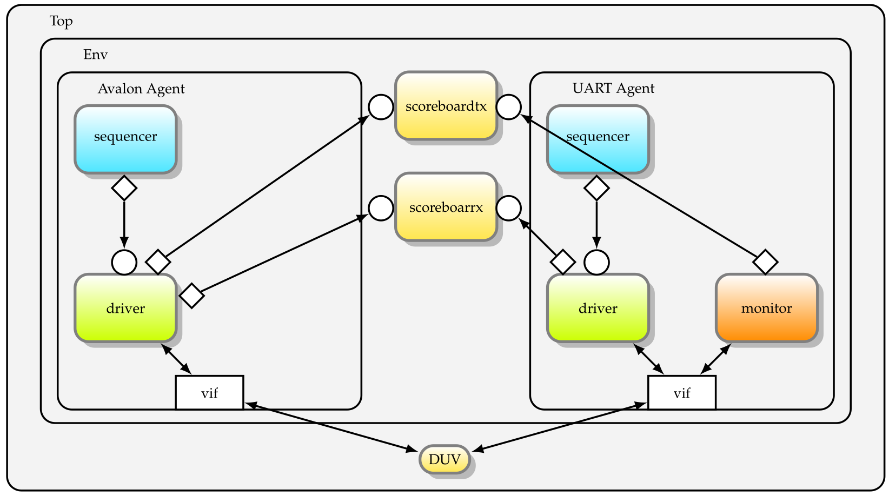
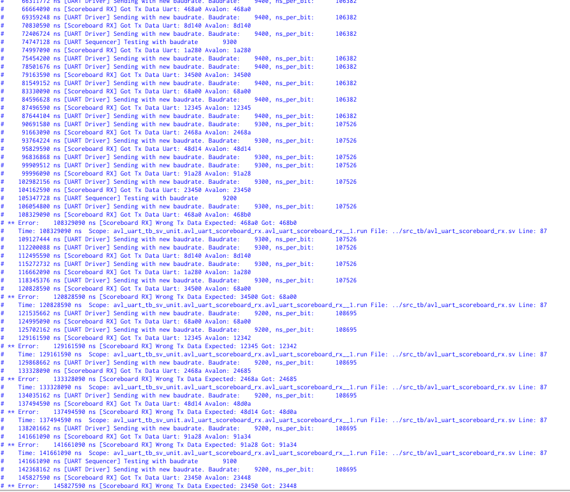
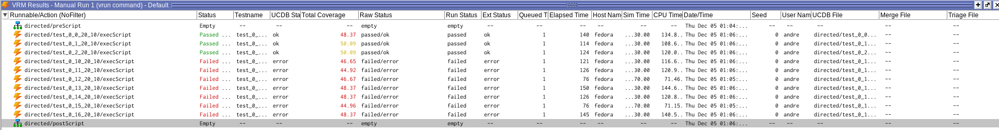

# <center> Laboratoire n°02 {ignore=true}

# <center> UART {ignore=true}

## <center>Département : TIC {ignore=true}

## <center>unité d’enseignement VSE {ignore=true}

<br>
<br>
<br>
<br>
<br>
<br>
<br>
<br>
<br>
<br>
<br>
<br>
<br>
<br>

Auteur: **Andrè Costa & Alexandre Iorio**

Professeur: **Yann Thoma**

Assistant : **-**

Salle de labo : **A07**

Date : **13.12.2024**

<!--pagebreak-->

## <center>Table des matières {ignore=true}

<!-- @import "[TOC]" {cmd="toc" depthFrom=1 depthTo=6 orderedList=false} -->

<!-- code_chunk_output -->

- [1. Introduction](#1-introduction)
- [2. Analyse du Problème](#2-analyse-du-problème)
- [3. Architecture](#3-architecture)
  - [3.3 Responsabilités des composants](#33-responsabilités-des-composants)
    - [3.3.1 Avalon Agent](#331-avalon-agent)
    - [3.3.2 UART Agent](#332-uart-agent)
    - [3.3.3 Scoreboards](#333-scoreboards)
- [4. Implémentation](#4-implémentation)
  - [4.1 Données traitées pas le driver de l'agent Avalon](#41-données-traitées-pas-le-driver-de-lagent-avalon)
  - [4.2 Driver Avalon](#42-driver-avalon)
  - [4.3 Driver UART](#43-driver-uart)
  - [4.4 Monitor UART](#44-monitor-uart)
  - [4.5 Scoreboards](#45-scoreboards)
  - [4.6 Difficultés rencontrées et solutions](#46-difficultés-rencontrées-et-solutions)
    - [4.6.1. Arrêt prématuré de la simulation](#461-arrêt-prématuré-de-la-simulation)
    - [4.6.2. Quantité de données à lire inconnue du côté Avalon](#462-quantité-de-données-à-lire-inconnue-du-côté-avalon)
    - [4.6.2. Timeout pour certains tests](#462-timeout-pour-certains-tests)
- [5. Tests](#5-tests)
  - [5.1 Scénarios de test](#51-scénarios-de-test)
    - [5.1.1. - Test 1 d'écriture](#511---test-1-décriture)
    - [5.1.2. - Test 2 de lecture](#512---test-2-de-lecture)
    - [5.1.3. - Test 3 à 5 du registre de status](#513---test-3-à-5-du-registre-de-status)
    - [5.1.4 - Test 6 des valeurs limites Boundaries](#514---test-6-des-valeurs-limites-boundaries)
    - [5.1.5 - Test 7 de la configuration du nombre de cycles par bit](#515---test-7-de-la-configuration-du-nombre-de-cycles-par-bit)
    - [5.1.6 Test 8 avec des valeurs aléatoires](#516-test-8-avec-des-valeurs-aléatoires)
    - [5.1.7 Test 9 et 10, stress tests](#517-test-9-et-10-stress-tests)
    - [5.1.8 Test 11 et 12 Tests Baudrate](#518-test-11-et-12-tests-baudrate)
  - [5.2. Couvertures des valeurs](#52-couvertures-des-valeurs)
  - [5.3. Assertions](#53-assertions)
  - [5.4. Tests supplémentaires possible](#54-tests-supplémentaires-possible)
- [6. Analyse des résultats](#6-analyse-des-résultats)
- [7. Conclusion](#7-conclusion)

<!-- /code_chunk_output -->

<!-- pagebreak -->

## 1. Introduction

Ce laboratoire a pour objectif de réaliser le développement et la mise en place d'un banc de test pour un composant UART, avec une hiérarchie `UVM`. Nous verrons dans ce rapport les différentes étapes de développement, les choix d'architecture, les difficultés rencontrées et les résultats obtenus.

## 2. Analyse du Problème

Nous n'avons pas connaissance du contenu du `DUV` et nous devons nous assurer que les données envoyées et reçues sont correctes. De manière générale, nous savons que le design à vérifier ne comporte pas d'erreur. Nous avons donc à disposition un paramètre `ERRNO` qui nous permettra de simuler des erreurs.

## 3. Architecture

L'architecture `UVM` simplifiée est structurée de la manière suivante:



<!-- pagebreak -->

### 3.3 Responsabilités des composants

Afin de bien comprendre l'architecture, nous allons détailler les responsabilités de chaque composant.

#### 3.3.1 Avalon Agent

- **SEQUENCER**: le séquenceur récupérera le `testcase` à jouer et générera des séquences de transactions à réaliser. Ces séquences seront ensuite transmises au `driver` via un `FIFO`.

- **DRIVER**: le driver est responsable d'envoyer les transactions au `DUV` via l'interface `vif` et d'envoyer une copie de la transaction jouée au `scorboardtx`. Dans le cadre de ce laboratoire, le driver est également responsable de jouer le rôle de `monitor` et de transmettre les transactions reçues au `scorboardrx`, cela de manière à simplifier l'architecture.

#### 3.3.2 UART Agent

- **SEQUENCER**: comme le séquenceur de l'agent `Avalon`, le séquenceur récupérera le `testcase` à jouer et générera des séquences de transactions à réaliser. Ces séquences seront ensuite transmises au `driver` via un `FIFO`.

- **DRIVER**: le driver est responsable d'envoyer les transactions au `DUV` via l'interface `vif` et d'envoyer une copie de la transaction jouée au `scorboardtx`.

- **MONITOR**: le monitor est responsable de récupérer les transactions reçues par le `DUV` et de les transmettre au `scorboardrx`.

#### 3.3.3 Scoreboards

- **SCOREBOARDTX**: le scoreboardtx est responsable de vérifier que les transactions envoyées par le `driver` de l'agent `Avalon` sont similaires à celle reçue du `monitor` de l'agent `UART`. Il compare les transactions et informe l'utilisateur en cas d'erreur.

- **SCOREBOARDRX**: le scoreboardrx est responsable de vérifier que les transactions envoyées par le `driver` de l'agent `UART` sont similaires à celle reçue par le `driver` de l'agent `Avalon`. Il compare les transactions et informe l'utilisateur en cas d'erreur.

<!-- pagebreak -->

## 4. Implémentation

Afin de pouvoir implémenter les différents systèmes, nous avons admis un `baudrate` unique de `9600 [baud]`, ainsi qu'une taille de données `DATASIZE` de `20 [bit]`.
De plus, pour pouvoir valider et comprendre le fonctionnement du `DUV` nous avons décidé d'implémenter en premier le `driver` du côté de l'agent `Avalon`. Une donnée a été passée au duv et nous avons remarqué que la sortie `tx_o` du `vif` du côté `UART` était correctement mise à jour. Nous avons ensuite implémenté le `driver` du côté de l'agent `UART` et nous avons pu constater que la donnée était correctement reçue du côté `Avalon`. Dès lors nous sommes capables de communiquer entre les deux agents. Nous avons donc pu implémenter la partie vérification avec l'architecture `UVM`.

### 4.1 Données traitées pas le driver de l'agent Avalon

Pour permettre au `driver` de l'agent `Avalon` de transmettre des données au `DUV`, une `class` `avalon_transaction` a été définie. Cette `class` contient les propriétés suivantes:

```systemverilog
  avalon_transaction_type_t transaction_type;
  rand logic [31:0] data;
  logic [31:0] clk_to_wait_before_transaction;
```

Ces trois propriétés permettent de définir la donnée à manipuler, un temps d'attente avant de jouer la transaction ainsi que le type de transaction à jouer.

```systemverilog
typedef enum {
  UART_SEND,
  UART_READ,
  SET_CLK_PER_BIT,
  ASSERT_TX_FIFO_EMPTY,
  ASSERT_RX_FIFO_FULL,
  ASSERT_RX_FIFO_EMPTY,
  ASSERT_RX_FIFO_NOT_EMPTY,
  ASSERT_TX_FIFO_FULL,
  ASSERT_TX_FIFO_NOT_EMPTY,
  ASSERT_CLK_PER_BIT,
  UART_READ_UNTIL_EMPTY
} avalon_transaction_type_t;
```

Ces types seront utilisés pour définir la commande du `driver` de l'agent `Avalon`. En voici la description:

- `UART_SEND`, indique au driver de l'agent `Avalon` de transmettre une donnée au `DUV` en écrivant dans le registre ``1` `.
- `UART_READ`, indique au driver de l'agent `Avalon` de lire une donnée du `DUV` en lisant le registre ``2` `.
- `SET_CLK_PER_BIT`, indique au driver de l'agent `Avalon` de configurer le `DUV` en écrivant dans le registre ``3` `.
- `ASSERT_TX_FIFO_EMPTY` indique au driver de vérifier que le buffer `tx` est vide - Lecture du registre `0` et vérification des bits `0` et `3`
- `ASSERT_RX_FIFO_FULL` indique au driver de vérifier que le buffer `rx` est plein - Lecture du registre `0` et vérification des bits `1` et `2`
- `ASSERT_RX_FIFO_EMPTY` indique au driver de vérifier que le buffer `rx` est vide - Lecture du registre `0` et vérification des bits `1` et `2`
- `ASSERT_RX_FIFO_NOT_EMPTY` indique au driver de vérifier que le buffer `rx` n'est pas vide - Lecture du registre `0` et vérification du bit `2`
- `ASSERT_TX_FIFO_FULL` indique au driver de vérifier que le buffer `tx` est plein - Lecture du registre `0` et vérification des bits `0` et `3`
- `ASSERT_TX_FIFO_NOT_EMPTY` indique au driver de vérifier que le buffer `tx` n'est pas vide - Lecture du registre `0` et vérification du bit `3`
- `ASSERT_CLK_PER_BIT` indique au driver de vérifier que le baudrate est correct - Lecture du registre `3`
- `UART_READ_UNTIL_EMPTY` indique au driver de lire toutes les données du buffer `rx` - Lecture du registre `2` jusqu'à ce que le buffer `rx` soit vide

<!-- pagebreak -->

### 4.2 Driver Avalon

Le `driver` de l'agent `Avalon` est relativement complexe. En effet, il doit être capable d'interagir avec les différents registres du `DUV`. Ces registres sont nécessaires pour configurer le `DUV`, pour transmettre et récupérer des données ainsi que pour connaitre l'état de la fifo de réception et d'envoi.

| Address | Size |  Direction   | Description                 |
| ------- | :--: | :----------: | :-------------------------- |
| `0x0`   |  x   |     Read     | Status register             |
| `0x1`   |  20  |    Write     | Send register               |
| `0x2`   |  20  |     Read     | Receive register            |
| `0x3`   |  32  | Read / Write | Configuration : cycle / bit |

Les valeurs obtenues lors de la lecture du registre de status à l'adresse `0x0` sont les suivantes:

| Bit | Description                             |
| :-: | :-------------------------------------- |
| `0` | Send buffer full                        |
| `1` | Receive buffer full                     |
| `2` | number of élément inside receive buffer |
| `3` | Send buffer empty                       |

Le `driver` de l'agent `Avalon` recevra les transactions du séquenceur et en fonction de la commande afféctée, il jouera la transaction correspondante grâce à sa tâche:

```systemverilog
  task do_transaction(avalon_transaction transaction);
```

Cette `task` contient un `switch case` relatif à la propriété `transaction_type` du paramètre `transaction`. En fonction de la valeur de cette propriété, le `driver` jouera la transaction correspondante.

Afin de pouvoir exécuter tous les types de transaction, le driver implémente les `task` suivantes:

```systemverilog
    task do_read(logic [13:0] address);
    task do_write(logic [13:0] address, logic [31:0] data);
```

Si une commande de lecture ou d'écriture est reçue, le driver transmettra la transaction au `DUV` via l'interface `vif` et enverra une copie de la transaction au `scoreboardtx` ou au `scoreboardrx`.

Dans le cas où une commande de vérification est reçue, le driver lira le registre correspondant et vérifiera que les valeurs sont correctes. Si une erreur est détectée, une assertion sera levée. Aucune copie de la transaction ne sera envoyée au `scoreboardtx` ou au `scoreboardrx`.

Pour terminer, si le driver reçoit une commande de configuration, il configurera le `DUV` en écrivant dans le registre correspondant. Aucune copie de la transaction ne sera envoyée au `scoreboardtx` ou au `scoreboardrx`.

### 4.3 Driver UART

Le `driver` de l'agent `UART` est relativement simple. Il doit envoyer des données au `DUV` via le `vif` sur l'entrée `rx_i`. Le baudrate définit est identique à celui de l'agent `Avalon`, à savoir `9600 [baud]`.

Pour pouvoir effectuer cette action, le `driver` de l'agent `UART` implémente la `task` suivante:

```verilog
task run;
```

Cette task attend simplement une transaction, vérifie si le baudrate n'a pas été changé et écrira la donnée `bit` par `bit` en attendant le temps nécessaire entre chaque `bit`.

Ce temps nommé `ns_per_bit` est calculé de la manière suivante:

$$ ns_per_bit = \frac{1'000'000'000}{baudrate} $$

pour un baudrate de `9600 [baud]`, nous obtenons donc:

$$ ns_per_bit = \frac{1'000'000'000}{9600} = 104166.\overline{6} [ns] $$

Bien entendu, la transaction jouée par le `driver` de l'agent `UART` est également envoyée au `scoreboardrx` pour vérification.

<!-- pagebreak -->

### 4.4 Monitor UART

Le `monitor` de l'agent `UART` est responsable de récupérer les transactions reçues par le `DUV` et de les transmettre au `scorboardrx`. Pour ce faire, le `monitor` fonctionne comme le `driver` de `UART` mais en lisant les données reçues par le `DUV` sur la sortie `tx_o` du `vif`.

En fonction de la précision du temps d'attente entre la lecture de chaque `bits` nous ne pouvons pas lire de manière complètement synchronisée avec l'écriture du `driver` de l'agent `Avalon`. Afin de garantir que la lecture du bit désirée est correcte, nous avons décidé de décaler le début de la lecture de:

$$ offset_start = \frac{ns_per_bit}{2} $$

pour un baudrate de `9600 [baud]`, nous obtenons donc:

$$ offset_start = \frac{104166.\overline{6}}{2} = 52083.\overline{3} [ns] $$

Cela permet de lire le bit au milieu de la période d'écriture du `bit` par le `driver` de l'agent `Avalon`.

### 4.5 Scoreboards

Étant donné que nous sommes en mesure de récupérer les données transmises et reçues par le `DUV` via les différents composants de notre architecture, nous pouvons implémenter les `scoreboards`.

L'implémentation des scorboards est relativement simple et fonctionne, pour les deux `scoreboards`, de la manière suivante:

- Récupération de la transaction envoyée par l'un des `driver`
- Récupération de la transaction reçue par l'autre `driver` pour l'agent `Avalon` ou le `monitor` pour l'agent `UART`
- Vérification de la commande de la transaction et levée d'une assertion en cas de commande incorrecte.
- Comparaison des données envoyées et reçues, comptabilisation des erreurs et informations de l'utilisateur.

### 4.6 Difficultés rencontrées et solutions

Lors du développement de ce laboratoire, nous avons rencontré quelques difficultés. Afin de les résoudre, nous avons mis en place les solutions suivantes:

#### 4.6.1. Arrêt prématuré de la simulation

Lors de nos premiers tests de transmission, nous avons subi des arrêts de simulation prématurés, en effet, nous avions que la moitié du premier bit envoyé. Après avoir investigué, nous avons constaté que le `driver` nous n'implémentions pas le principe d'`objection` permettant d'informer l'environnement que nous sommes en train d'effectuer un travail et que le test bench doit attendre que cette objection soit désactivée.

Pour cela chaque composant lève (`raise`) une `objection` avant de débuter la tâche et l'annule (`drop`) une fois terminé. Ceci permettra au test bench de s'arrêter si aucun composant ne relève plus d'objections après `210'000 [ns]`.

Voici les éléments qui ont nécessité l'ajout d'une `objection`:

- **Scoreboard TX et RX**: Lors du traitement des deux transactions reçues
- **Driver Avalon**: lors de l'exécution d'une transaction (lecture, écriture, etc.)
- **Driver UART**: lors de l'envoi d'une donnée
- **Moniteur UART**: Lors de la détection du bit de start jusqu'à la fin de la lecture des données

#### 4.6.2. Quantité de données à lire inconnue du côté Avalon

Selon le scénario de test, par exemple, lors de tests de couvertures, nous pouvons être dans une situation où nous ne savons pas combien de données seront envoyées du côté UART. Ceci est nottament vrai pour les tests de randomisation qui sont gèrés par la couverture. En effet, nous ne pouvons pas prédire en avance combien de transactions doivent être générées pour atteindre la couverture demandée.

Ceci est donc la raison pour laquelle nous avons décidé de rajouter une commande `UART_READ_UNTIL_EMPTY` qui permet de lire toutes les données de la FIFO RX. Cette commande est envoyée par le séquenceur `Avalon` et permet de lire toutes les données reçues sans savoir combien il y en a.

Cet ajout nous mène à un troisième problème.

#### 4.6.2. Timeout pour certains tests

Si le système marche correctement, cette implémentation ne pose aucun soucis. Cependant, comme nous avons pu constater, si le DUV gère mal l'état de la fifo de réception en indiquant faussement qu'elle n'est pas vide lorsque que le sequenceur `Avalon` envoie la commande `UART_READ_UNTIL_EMPTY`, le driver `Avalon` va lire des données qui n'existent pas vraiment remplissant ainsi la fifo Driver Avalon -> Scoreboard RX. Ceci pose problème car le scoreboard consomme seulement une donnée `Avalon` pour chaque donnée `UART` reçue et comme ces données n'ont pas été envoyées par le driver `UART`, le système restera bloqué.

Ceci est résolu si l'on `drop` l'objection avant d'ajouter des données à la fifo. Ceci permet au test bench de finir si le driver `Avalon` bloque en ajoutant des données à la fifo vu que l'objection n'est plus levée.

```verilog
UART_READ_UNTIL_EMPTY: begin
  automatic avalon_transaction trans;
  while (1) begin
    ...
    // Don't block the simulation in case the scoreboard
    // can't keep receive anymore data
    // This can happen if for instance, we read data
    // that wasn't actually sent to the DUV
    // and fill out the scoreboard fifo
    objections_pkg::objection::get_inst().drop();
    avalon_to_scoreboard_rx_fifo.put(trans);
    objections_pkg::objection::get_inst().raise();
    ...
  end
end
```

## 5. Tests

Nous avons maintenant un système complet qui permet de vérifier la communication entre les deux agents. Nous allons donc pouvoir réaliser des tests.

Ces tests seront réalisés selon le un numéro de testcase transmis en argument lors de l'exécution du testbench.

Dans les séquenceurs, ce numéro de testcase est utilisé pour définir les transactions à jouer.
Il y a une forte correspondance entre le séquenceur de l'agent `Avalon` et le séquenceur de l'agent `UART`. En effet, les deux séquenceurs doivent jouer les mêmes scénarios, mais du point de vue de l'agent qu'ils contrôlent.

### 5.1 Scénarios de test

Afin de garder la même convention tout au long du développement, nous avons décidé que `write` et `read` sont toujours du point de vue de l'agent `Avalon`.
De ce fait, un read côté `Avalon` est une écriture côté `UART` et vice versa.

#### 5.1.1. - Test 1 d'écriture

Le premier test consiste à vérifier que la donnée que nous écrivons du côté de l'agent `Avalon` est bien reçue du côté de l'agent `UART`.
De plus, nous vérifions que le registre de status est bien mis à jour.

#### 5.1.2. - Test 2 de lecture

Ce deuxième test consiste à vérifier que la donnée que nous écrivons du côté UART est bien reçue du côté Avalon.

Ici, il devient évident l'utilité d'avoir une façon d'indiquer à notre driver de patienter avant de lire la donnée, en effet, sans cela, le driver `Avalon` essayerait de lire la donnée avant que le driver `UART` n'ait eu le temps de l'envoyer.
De plus, nous vérifions que le registre de status de manière à nous assurer que le fifo de réception n'est pas vide.

#### 5.1.3. - Test 3 à 5 du registre de status

Les tests 3 à 5 sont des tests qui permettent de vérifier que les flags de status pour les FIFOs sont correctement mis à jour.

- **Test 3** - vérifie que la fifo `tx` est bien détectée comme vide.
- **Test 4** - envoie `FIFOSIZE + 1` données pour vérifier que la fifo `tx` est bien détectée comme pleine.
- **Test 5** - du côté UART, on envoie `FIFOSIZE` données - du côté Avalon, on attend que la fifo `rx` soit pleine et on lit toutes les données

#### 5.1.4 - Test 6 des valeurs limites Boundaries

Ce sixième test vérifie ce qu'il se passe avec les données aux limites, c'est-à-dire, l'envoie de `0` et de `2^DATASIZE - 1`.
Ceci est fait en parallèle des deux côtés, UART et Avalon.

#### 5.1.5 - Test 7 de la configuration du nombre de cycles par bit

Le septième test vérifie que la configuration que nous écrivons dans le registre `3` est bien prise en compte et que la valeur écrite est la valeur lue.

#### 5.1.6 Test 8 avec des valeurs aléatoires

Le huitième test consiste à envoyer des payloads aléatoires. Ce test est géré par la couverture et permet de trouver des potentiels erreurs avec des valeurs que nous aurions pas forcément pensé à tester.

#### 5.1.7 Test 9 et 10, stress tests

Ces tests sont les derniers tests automatiques que nous avons implémentés.

Pour finisaliser les tests automatiques, nous avons ajouté deux tests de stress, un test RX et un test TX.

Pour le test `tx` et `rx`, nous transmettons des données et nous nous assurons de la maintenir les fifo relatives à `tx` ou `rx` pleines pendant toute la durée du test.

La durée du test s'étend sur l'envoi de `FIFOSIZE * 10` données.

#### 5.1.8 Test 11 et 12 Tests Baudrate

Ces tests ne sont pas des test automatiques, et le `testcase 0` ne les lancera pas. Ce sont des tests qui produisent des erreurs.

En effet, ces tests vont, du côté UART, envoyer des données avec un baudrate incorrect, qui va s'incrémenter/décrémenter gentiment.
Ceci permet de voir à quel moment le DUV n'arrive plus à lire les données correctement.

Ici nous pouvons voir que le DUV arrive à bien travailler avec un baudrate entre ~9300 et ~9900 pour un baudrate défini à 9600.

Voici l'output des tests:

**Test 11 - Baudrate trop haut**



**Test 12 - Baudrate trop bas**


### 5.2. Couvertures des valeurs

Pour le `testcase 8` nous avons ajouté une couverture des valeurs pour les données envoyées et reçues.
Afin de rester pertinent et ne pas impacter trop fortement la charge de calcul, nous avons décidé d'ajouter dans la class `avalon_transaction` le covergroup suivant:

```verilog
covergroup cov_group;
    cov_data: coverpoint data[DATASIZE-1:0] {
      bins petit = {[0 : max_value() / 4]};
      bins grand = {[max_value() - (max_value() / 4) : max_value()]};
      bins all_values[DATASIZE] = {[max_value() / 4 + 1 : max_value() - (max_value() / 4) - 1]};
    }
  endgroup
```

Ce covergroup nous semble raisonnable, car il permet de vérifier que les valeurs limites sont bien couvertes ainsi que les valeurs intermédiaires.

### 5.3. Assertions

En plus de la simulation, nous avons remarqué la possibilité d'y ajouter des assertions qui aident à la vérification du système.

Typiquement, le fait que `byte_enable_i` n'est pas utilisé, ou, que, lors d'une lecture, la donnée est valide le coup de clock suivant nous avons pu retranscrire ces assertions de la manière suivante:

```systemverilog
  // En lecture, la donnée est prête un cycle après que avl_read_i est à ’1’.
  // En lecture, avl_readdatavalid_o s’active lorsque la donnée est disponible.
  assume_readdatavalid_after_read :
  assume property (avl_read_i |=> avl_readdatavalid_o);

  //Le signal byteenable n’est pas utilisé.
  assume_byteenable_is_not_used :
  assume property (avl_byteenable_i == 8'hf);
```

En plus, quelques vérifications sur le range des adresses:

```systemverilog
    //Valide qu'on n'essaie pas de lire une adresse plus grande que 3
    assume_address_on_read_is_lower_than_4 :
    assume property (avl_read_i |-> (avl_address_i < 4));

    //Valide qu'on n'essaie pas d'écrire une adresse plus grande que 3
    assume_address_on_write_is_lower_than_4 :
    assume property (avl_write_i |-> avl_address_i < 4);
```

Sur la cohérence des bits de status:

```systemverilog
  // Vérifie que le status du buffer tx est cohérent
  // i.e le status vide et le status plein ne sont pas les deux à 1
  assume_status_register_tx_fifo_status_coherence :
  assume property (avl_read_i && (avl_address_i == 0)
    |=> (avl_readdata_o[3] == 0 || (avl_readdata_o[3] != avl_readdata_o[0])));


  // Vérifie que le status du buffer rx est cohérent
  // i.e si le buffer est plein, il faut aussi que le registre indique un
  // élément disponible
  assume_status_register_rx_fifo_status_coherence :
  assume property (avl_read_i && (avl_address_i == 0) ##1 avl_readdata_o[1] |-> avl_readdata_o[2]);
```

Sur les protocole UART et Avalon:

```systemverilog
  //En écriture, avl_waitrequest_o permet de faire patienter le master
  // selon le fonctionnement normal du bus avalon.
  assume_wait_request_is_respected :
  assume property (avl_waitrequest_o && avl_write_i |=> avl_write_i && (avl_writedata_i == $past(
      avl_writedata_i
  )));

  // vérifie que la ligne tx_o repasse `eventuellement` à 1
  assume_tx_eventually_goes_back_to_1 :
  assume property ($fell(tx_o) |=> ##[0:$] tx_o == 1);

  // vérifie que la ligne rx_i repasse `eventuellement` à 1
  assume_rx_eventually_goes_back_to_1 :
  assume property ($fell(rx_i) |=> ##[0:$] rx_i == 1);
```

### 5.4. Tests supplémentaires possible

Il aurait été idéal de pousser ces vérifications plus loin, en vérifiant par exemple que la ligne `tx` passe à `1` au bout de `DATASIZE * clk_per_bit`.
Étant donné que le nombre de `clk_per_bit` n'est pas fixe, il nous est difficile de savoir quand une lecture va commencer.

## 6. Analyse des résultats

Nous avons maintenant un système complet qui permet de vérifier la communication entre les deux agents et ainsi lancer des scénarios couvrant la major partie du fonctionnement du `DUV`.

Le lancement de tous les scénarios , hormis les tests 11 et 12, nous donne de bons résultats.

Afin de nous assurer de la bonne implémentation des tests ainsi que la pertinence des scénarios, nous avons exécuté le tout avec des valeurs `ERRNO` entre `10` et `16` qui génère incohérences dans les données envoyées et reçues.

Cest test ont été insérés dans `Questa Verification Run Manager`. En voici la sortie:



La durée des tests confirme la pertinence de notre coverage en atteignant les `100%` au bout de `~ 2 [min]`.

## 7. Conclusion

Ce laboratoire nous a permis de concevoir et de mettre en œuvre un banc de test en SystemVerilog pour vérifier un périphérique UART. En intégrant des drivers, moniteurs, scoreboards, assertions et objections, nous avons créé un environnement de test robuste couvrant divers scénarios, incluant les cas limites, stress tests, et configurations aléatoires.

Les tests ont confirmé le bon fonctionnement du périphérique dans des conditions normales et identifié les limites lors de l'utilisation de baudrates non conformes. Les assertions ont renforcé la vérification en garantissant le respect des protocoles UART et Avalon.

Ce projet a démontré l'importance d'une approche méthodique en vérification, en mettant en avant la précision nécessaire pour synchroniser les composants et gérer efficacement les transactions. Ce fut une excellente opportunité d’approfondir nos compétences en vérification tout en validant un système complexe.
