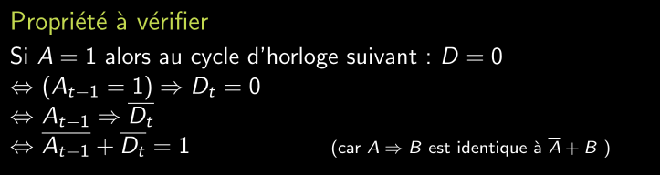

Vérification formelle adapté pour des petites systèmes simples avec des cas d'utilisation relativement limités.

## Utilisation d'un loggeur

Pour pouvoir facilement modifier les messages qui sont affichés (selon le niveau de gravité), pouvoir facilement définir un fichier de sortie, le type du fichier de sortie etc..

## Compteur

Relativement limité en cas d'utilisation, on peut facilement décrire le comportement attendu et donc utiliser la verification formelle pour le vérifier.

## Design complexe

Mélanger la vérification formelle et fonctionnelle. Il est rapidement difficile de mettre en place la vérification formelle.


```sv
coverpoint rssi;
cov_size_low : coverpoint size {
        bins low[16] = {[0:15]};
        ignore_bins others = default;
}
cov_adv: coverpoint adv;

cross cov_size_low, cov_adv;

cov_channel: coverpoint channel {
        bins b1 = {0};
        bins b2 = {24};
        bins b3 = {78};
        ignore_bins others = default;
}
cov_adv_one : coverpoint adv {
    bins b1 = {1};
    ignore_bins others = default;
}

cross cov_adv_one, cov_channel;

coverpoint address {
  option.auto_bin_max = 255;
}
```


```sv
default clocking cb @(posedge clk);
endclocking

assert property (!(a & b));
assert property  (valid |=> busy && !acq ##[1:$] !busy && acq);
assert property (wr |-> active );
assert property (wr[*2] |-> $stable(address) & $stable(data));
assert property ($fell(wr) |-> $past(ready));
```


```sv
class Packet;
...
rand bit wrong_parity;
rand bit mult_four;

constraint wp_distr {
    wrong_parity dist {
        0 := 99,
        1 := 1
    }
}
constraint mfour_dist {
    mult_four dist {
        0 := 75,
        1 := 25
    }
}

function post_randomize();
    parity = calc_parity(data,length);
    if (wrong_parity) begin
        parity = ~parity
    end
endfunction

constraint type {
    (ptype == 0) -> (length == 0);

    (ptype != 0 && mult_four) -> (length % 4 == 0);

    (ptype != 0 && !mult_four) -> (length % 4 != 0);
}

constraint source_dst {
    source != dest;
}
constraint dst {
    (ptype == 1) -> (dest > source);
}

constraint order {
    solve ptype before length, source, dest;
    solve mult_four before length;
}

```


----


    
```sv
    class MyClass;
        logic [7:0] a;
        logic [7:0] b;
        logic [7:0] c;

        covergroup my_group;
            //(a)
            a_cov : coverpoint a{
                bins low[]={[0:3]};
                ignore_bins high[]={[4:255]};
            }
            //(a)
            b_cov : coverpoint b {
                bins middle[]={[8:11]};
                ignore_bins low[]={[0:7]};
                ignore_bins high[]={[12:255]};
            }
            //(b) 
            c_cov : coverpoint c {
                option.at_least = 15;
                bins high[]={[250:255]};
            }
            //(a)
            cov_a_cross_b : cross a_cov, b_cov;

        endgroup

        //(c) toute combinaison de a, b et c pair
        covergroup parity_of_properties:

            a_cov : coverpoint a[0];
            b_cov : coverpoint b[0];
            c_cov : coverpoint c[0];

        cross a_cov, b_cov, c_cov;

        endgroup

    end class : MyClass
```


```sv
default clocking cb @(posedge clk);
endclocking

assert_1: assert property ($rose(a) |-> (a throughout (##[0:$] $rose(b) ##[1:$] $rose(b) ##[1:$] $rose(b))));

assert_2: assert property (a[*3] |-> (!b[*2]##[1:3] b[*3] ##1 !b) || (!b[*6]##[1:2] b[*4:5]##1 !b));

assert_3_sending: assert property (sending |-> valid); 

assert_3_starting: assert property ($rose(starting) |-> $rose(sending) ##1 !sending);

assert_3_first: assert property ($rose(sending) |-> first ##1 !first);

assert_3_ending: assert property (ending |=> !sending));

assert_3_last: assert property (last |-> sending ##1 !sending);

assert_3_valid: assert property ($rose(sending) |-> !valid[*0:$] ##[1:$](valid && data>0));

```


```sv
class MyClass ;

rand logic[7:0] a;
rand logic[7:0] b;
rand logic[7:0] c;
rand logic[7:0] d;

// ajouté pour la contrainte 2
rand logic c_parity;

constraint constraint_1 {
    // les trois derniers bits de a sont 0 donc un multiple de 8
    a[2:0] == 0 -> b[1:0] == 0;
}


constraint constraint_2 {
    
    a[0] == 0 -> c[0] == c_parity;
}

constraint constraint_2_1 {
    c_parity dist {
        0 := 10,
        1 := 90
    };
}

constraint constraint_3 {
     a[0] == 0 -> (d % 5) == 0;
}

endclass : MyClass
```

4) Ajout d'un biais sur b. 
5) On va avoir un conflic entre les contraintes précedente (expliquer pk)


Assume permet de dire au systeme qu'on suppose qu'une condition est toujours vrai, par exemple read n'est jamais en même temps que write. 

Assert va vérifier une condition et nous informer si elle est pas respectée. 




